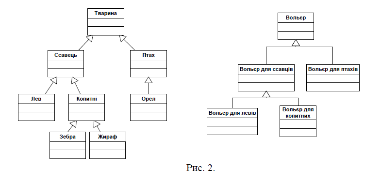

# TASK 4

## Generics

### Варіант 2. Реалізувати із застосування узагальненого програмування ієрархію Java-класів для вольєрів з різними видами тварин.

У зоопарку є наступні види тварин: птахи (орли) та ссавці (леви, зебри, жирафи). Для цих тварин передбачено вольєри: вольєри для левів, вольєри для копитних (зебр та
жирафів), вольєри для птахів. Ієрархія вказаних об’єктів подана на рис. 

Додайте в меню команду для збереження тварин в файл та передбачте можливість читання набору тварин з файлу (використовуючи ObjectOutputStream та ObjectInputStream)

У вольєрі для левів можна розмістити тільки левів. У вольєрі для птахів – тільки птахів. У вольєрі для копитних – тільки зебр та жирафів. Реалізувати на основі
узагальненого програмування (generics) вказані обмеження щодо розміщення тварин.

Для класів вольєрів реалізувати наступні функції:
- Кожен вольєр має максимальну ємність (кількість тварин). Реалізувати функцію для отримання максимальної кількості місць та функцію для отримання кількості зайнятих місць.
- Розміщення тварини у вольєрі. Якщо всі м’ясця у вольєрі зайнято, функція повинна ініціювати виключну ситуацію.
- Вилучення тварини із вольєра. Функція повинна ініціювати виключну ситуацію, якщо вказаної тварини немає у вольєрі.
  Додатково реалізувати функцію підрахунку кількості тварин, які знаходяться у вольєрах зоопарку. Варіант коду наданий нижче. Дописати код до працездатного.
  Обов’язково використовувати generics та wildcard (де це потрібно). 
  

```java 
   public class Zoo { 
        public List<Cage> cages = new ArrayList<>();
        public int getCountOfAnimals (){
            
        }
        public void addCage(){
            
        }
    }
```

Реалізувати модульні тести з наповнення вольєрів різними тваринами (не забувайте і про тестування виключних ситуацій).